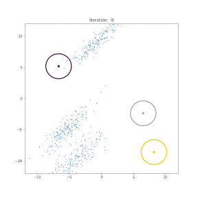
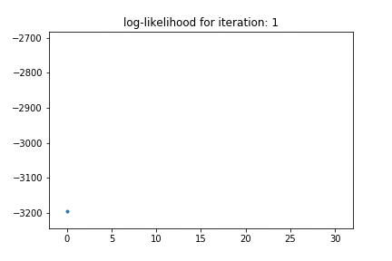

# GMM-EM-Python
 Python implementation of Expectation-Maximization algorithm (EM) for Gaussian Mixture Model (GMM).

 Code for GMM is in [GMM.py](GMM.py). It's very well documented on how to use it on your data. For an example and visualization for 2D set of points, see the notebook [EM_for_2D_GMM.ipynb](EM_for_2D_GMM.ipynb).

  

## Documentation:
 **class** GMM:
 - Parameters:
 	- k: Number of clusters
 	- dim: Dimension
 	- mu: Means of all clusters
 	- sigma: Covariance matrix of all clusters
 	- pi: Proportions of each cluster in P(x)
 	- colors: Colors for each cluster for plotting
 	- z: Latent variable Z (defined during EM init)
 	- num_points: Number of data points (defined during EM init)
 	- data: Dataset (defined during EM init)
 - Functions:
 	- __init__(self, k, dim, init_mu=None, init_sigma=None, init_pi=None, colors=None):
 	Defines a model with known number of clusters and dimensions.
    input:
        - k: Number of Gaussian clusters
        - dim: Dimension 
        - init_mu: initial value of mean of clusters (k, dim)
                   (default) random from uniform[-10, 10]
        - init_sigma: initial value of covariance matrix of clusters (k, dim, dim)
                      (default) Identity matrix for each cluster
        - init_pi: initial value of cluster weights (k,)
                   (default) equal value to all cluster i.e. 1/k
        - colors: Color valu for plotting each cluster (k, 3)
                  (default) random from uniform[0, 1]
    - init_em(self, X):
    Initialization for EM algorithm.
    input:
        - X: data (batch_size, dim)
    - e_step(self):
    E-step of EM algorithm.
    - m_step(self):
    M-step of EM algorithm.
    - log_likelihood(self, X):
    Compute the log-likelihood of X under current parameters
    input:
        - X: Data (batch_size, dim)
    output:
        - log-likelihood of X: Sum_n Sum_k log(pi_k * N( X_n | mu_k, sigma_k ))
    - plot_gaussian(self, mean, cov, ax, n_std=3.0, facecolor='none', **kwargs):
    Utility function to plot one Gaussian from mean and covariance.
    - draw(self, ax, n_std=2.0, facecolor='none', **kwargs):
    Function to draw the Gaussians.
    Note: Only for two-dimensionl dataset

## TODO:
- Handling singular covariance matrix problem.
- Better initialization methods.